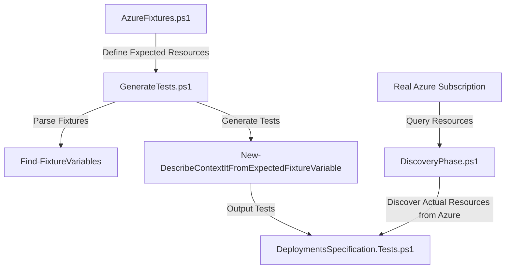

# AIWithReadmeDriven

This PowerShell-based framework provides an automated way to generate Behavior-Driven Development (BDD) style tests for Azure resources using Pester. It follows a fixture-based approach that allows you to define expected resources in a structured format and automatically generates comprehensive tests to validate that your Azure deployments match these specifications. This framework connects to a real Azure subscription to validate deployed resources against your specifications.

## 🚀 Quick Start

To run the complete automated workflow:

```powershell
# Run the complete generative flow - fixtures to report
.\Start-GenerativeFlow.ps1
```

This unified script will:
1. Read fixtures from AzureFixtures.ps1
2. Generate Pester tests from these fixtures
3. Run the tests and output NUnit XML results
4. Launch the React-based report viewer at http://localhost:3001

Alternatively, you can run only specific parts:

```powershell
# Run tests and launch the report viewer (without regenerating tests)
.\Start-TestAndViewer.ps1

# Only generate tests
.\Start-GenerativeFlow.ps1 -SkipTestExecution -SkipReportViewer

# Only run tests
.\Start-GenerativeFlow.ps1 -SkipTestGeneration -SkipReportViewer

# Only view reports
.\Start-GenerativeFlow.ps1 -SkipTestGeneration -SkipTestExecution
```

This will:
1. Generate Pester tests from fixtures
2. Run the tests and output NUnit XML results
3. Launch the React-based report viewer at http://localhost:3001

> **Note**: The React report viewer processes NUnit XML test results from Pester tests. It correctly handles test results with merged attributes and displays them in a user-friendly interface with filtering options. The report viewer reads the test summary from the root `test-results` element and processes nested test cases through the results hierarchy.

## How It Works

The framework consists of several components that work together:

1. **AzureFixtures.ps1** - Contains definitions of expected Azure resources in a structured format
2. **PesterTestGenerator.ps1** - Provides functions to convert fixture data into BDD-style Pester tests
3. **GenerateTests.ps1** - Main script that orchestrates the test generation process
4. **DiscoveryPhase.ps1** - Handles discovering actual Azure resources for comparison with fixtures
5. **DeploymentsSpecification.Tests.ps1** - The output file containing the generated Pester tests

## Test Generation Process



This framework connects to the real Azure subscription (38801999-1ab2-462d-99e1-9db9e1d9fc8c) to validate that your deployed resources match the specifications in your fixture files.

## Fixture Format

Fixtures are defined in `AzureFixtures.ps1` using a structured array format:

```powershell
$expectedStorageAccounts = @(
    @{
        FriendlyName = "Primary Storage Account"
        Name = "mystorageacct123"
        rgName = "my-resource-group"
        Location = "westus2"
        Tier = "Standard"
    }
)
```

## Generated Tests

The framework automatically generates Pester tests with:

- **Describe blocks** - One per resource type (StorageAccount, AppService, etc.)
- **Context blocks** - One per resource instance, using the FriendlyName
- **It blocks** - One per property to be validated

## Test Runner and Reporting

The framework now includes:

- **RunPesterTests.ps1** - A script that runs tests and outputs NUnit XML results compatible with Jira Xray
- **React Report Viewer** - A web-based UI for viewing, filtering, and analyzing test results
- **Start-GenerativeFlow.ps1** - An all-in-one script that manages the entire workflow from fixtures to reports

### Unified Workflow

The new `Start-GenerativeFlow.ps1` script provides a streamlined experience:

```powershell
# Run the complete workflow with all options
.\Start-GenerativeFlow.ps1 
    [-SkipTestGeneration]     # Skip generating new tests
    [-SkipTestExecution]      # Skip running the tests
    [-SkipReportViewer]       # Skip launching the report viewer
    [-AutoConfirm]            # Skip confirmation prompts
    [-ResultsPath <path>]     # Specify custom results directory
```

### Viewing Test Results

After running the tests, you can view the results in the React-based report viewer:

```powershell
# Option 1: Use the all-in-one script
.\Start-GenerativeFlow.ps1 -SkipTestGeneration -SkipTestExecution

# Option 2: Use the dedicated viewer script
.\Start-TestAndViewer.ps1 -SkipTestGeneration

# Option 3: Start the server manually
cd report-viewer
npm install  # First time only
node server.js
# Open http://localhost:3001 in your browser
```

The report viewer provides:
- Color-coded pass/fail status
- Filterable results by status and name
- Pie charts for each Describe suite section
- Detailed error information on fail from the azure cli or PS console
- Test counts and summaries
- NUnit XML formatting compatible with Jira Xray integration
- Web report will use json results instead (Powershell support json well)

## Important Implementation Notes

- **Discovery Phase Management**: The system uses a separate DiscoveryPhase.ps1 file to handle resource discovery instead of using BeforeDiscovery blocks directly in test files. This provides better separation of concerns and more flexibility in test execution.
- **Resource Loading**: Resources are loaded by importing functions from DiscoveryPhase.ps1 and calling Export-DiscoveredResources to get the discovered resources.
- **NUnit XML Output**: Test results are output in NUnit XML format, which is compatible with CI/CD pipelines and test management tools like Jira Xray.

Example of a generated test:

```powershell
Describe "StorageAccount Deployment Tests" {
    Context "Primary Storage Account Deployment Validation" -ForEach $expectedStorageAccounts {
        BeforeAll {
            $actual = $actualDeployedResources['StorageAccounts'] | Where-Object { $_.Name -eq $Name }
        }
        
        It "Primary Storage Account should exist" {
            $actual | Should -Not -BeNullOrEmpty -Because "StorageAccount should be created"
        }
        
        It "Should be named 'mystorageacct123'" {
            $actual.Name | Should -Be $Name -Because "Resource name should match specification"
        }
        
        It "Should be in the 'my-resource-group' resource group" {
            $actual.ResourceGroupName | Should -Be $rgName -Because "Resource should be in the specified resource group"
        }
    }
}
```

## Key Features

- **Unified Workflow** - Complete end-to-end testing flow from fixtures to interactive reports
- **Automatic Test Generation** - Tests are generated based on fixture variables in AzureFixtures.ps1
- **Resource Property Detection** - Automatically detects properties to test based on fixture structure
- **Intelligent Test Updates** - Preserves existing test structure when regenerating tests
- **Resource Type Detection** - Infers resource types from fixture variable names
- **Cleanup Functionality** - Removes unused backup files and temporary files
- **Interactive Report Viewer** - Modern React-based UI for analyzing test results
- **Jira Xray Integration** - NUnit XML output compatible with Jira's test management
- **Customizable Workflow** - Run only the parts of the process you need

## Usage

The test generation process is as simple as running the GenerateTests.ps1 script:

```powershell
./tests/GenerateTests.ps1
```

The script will:
1. Clean up any unused files
2. Discover fixture variables in AzureFixtures.ps1
3. Generate test blocks in DeploymentsSpecification.Tests.ps1 and use -ForEach with $fixtureVariable # usually an array of hashtables.
4. Preserve any existing custom code in the test file

## Benefits

- **Consistency** - Ensures consistent testing approach across all resources
- **Maintainability** - Easy to update tests when resources change
- **Readability** - Generated tests follow BDD style for better understanding
- **Extensibility** - Can be extended to support new Azure resource types

---

## Running The Generative Flow

To experience the full power of this framework, try the unified workflow:

```powershell
# Run the complete generative flow
.\Start-GenerativeFlow.ps1
```

You'll see a colorful terminal output guiding you through the process, and finally the test report will open in your browser.

---

This framework helps you validate that your Azure infrastructure deployments match your expected configurations, making it easier to catch deployment issues early and ensure consistent infrastructure. With the new unified workflow and interactive reporting, you can now manage the entire testing process from a single command and get immediate visual feedback on your test results.
